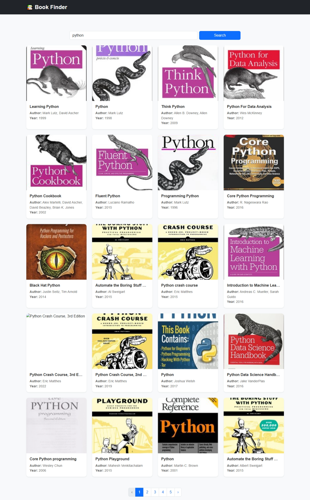

# 📚 Book Finder App

A simple and responsive React web application that allows users to search for books by title using the "Open Library API".
The app displays book details such as the cover image, author, publication year, and subjects in a clean, user-friendly layout.

# 👤 User Persona

- Name: Alex
- Occupation: College Student
- Need: Alex wants to easily search for books by title and view details like author, publication year, and subjects, all in one place.

This app helps Alex:

- Search for books by title
- View relevant book details
- Navigate results using pagination
- Enjoy a clean, responsive, and user-friendly interface

# ✨ Features

- Search books by title
- Display book covers, authors, and publication years
- Pagination (Next/Previous pages)
- Responsive layout for desktop and mobile
- Graceful error handling
- Loading spinner while fetching data

# 🧰 Tech Stack

| Category        | Technology                                                     |
| --------------- | -------------------------------------------------------------- |
| Framework       | React (via Vite)                                               |
| Styling         | Plain CSS / Bootstrap                                          |
| API             | [Open Library Search API](https://openlibrary.org/search.json) |
| Deployment      | CodeSandbox / StackBlitz                                       |
| Version Control | Git & GitHub                                                   |

# 🧠 API Used

Base URL:

https://openlibrary.org/search.json?title={bookTitle}

# ⚙️ Installation & Usage (React + Vite)

🖥️ Run locally

- Clone the repository
  git clone https://github.com/ssnishanthini/book-finder-app.git

- Go to the project folder
  **cd book-finder-app**

- Install dependencies
  **npm install**

- Start the development server
  **npm run dev**

Then open the link shown in your terminal —
Usually it’s "[http://localhost:5173/](http://localhost:5173/)"

# 🧩 Core Logic Overview

1. User inputs a book title in the search bar.
2. The app fetches results from the Open Library API using fetch().
3. The data is stored in state (books, page, numFound).
4. Books are displayed as responsive cards using Bootstrap.
5. Pagination controls let the user move between pages.

# 🖼️ Screenshot

# 👩‍💻 Author

**Nishanthini Sivakumar**

- 📧 (ssnishanthini2002@gmail.com)
- 🌐 [GitHub Profile](https://github.com/ssnishanthini)
